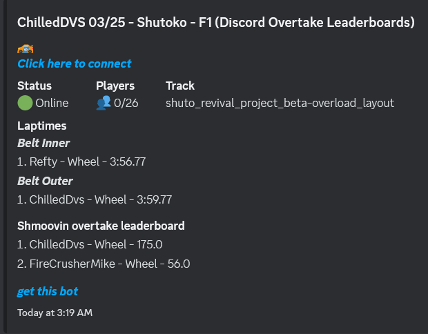
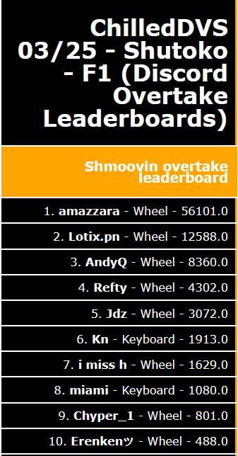

# AC Leaderboard Bot

A server-side Python script that monitors Assetto Corsa / AssettoServer log files and posts live leaderboards to Discord via webhooks. Also generates HTML overlay files for use in OBS.




---

## What it does

- Loops through a parent folder containing all your server folders
- Identifies server folders using a configurable string (e.g. `(server`)
- For each server, scans the latest log file(s) for:
  - **Lap times** — from standard AC/AssettoServer log output
  - **Stage/sector times** — from Shutoko-style sector splits
  - **Drift scores** — via the Shmoovin drift Lua script (CSP)
  - **Overtake scores** — via the Shmoovin overtake Lua script (CSP)
- Posts one Discord embed per server and keeps it updated (edit, not repost)
- Deletes the Discord message if a server folder is removed
- Generates HTML files per server in the `html/` folder for live OBS overlays
- Reads the server name from the server's `server_cfg.ini`
- Detects which Shmoovin script is active by checking `cfg/csp_extra_options.ini`
- Automatically shortens usernames and trims entries if the Discord message exceeds the character limit
- Filters usernames against a configurable banned words list

---

## Requirements

- Python 3
- `requests` library:
```
pip install requests
```

---

## Setup

1. Copy `config/config.yaml` (or create one based on the options below) and fill in your values
2. Run the script:
   - **Windows:** double-click `start.bat`
   - **Linux/terminal:** `python src/leaderboard.py`
3. Optionally serve the `html/` folder with Caddy using `start caddy.bat` (port 8888)

---

## config/config.yaml

```yaml
interval: 2                          # how often to update leaderboards (minutes)
servers_pathlst:
  - C:\path\to\your\acservers        # one or more parent folders containing server folders
folder_identifier: "(server"         # string used to identify server subfolders
leaderboard_limit: 10                # max entries shown per leaderboard
web_hook_url: "https://discord.com/api/webhooks/..." 
server_adress: 127.0.0.1             # actual server IP (used internally)
server_adress_display: my.server.com # IP/hostname shown in Discord messages
only_leaderboards: false             # true = hide full server info, show scores only
show_input: true                     # show input method (Wheel / Gamepad / Unknown)
use_short_name: false                # shorten long usernames to save space
log_lookback: 5                      # how many recent log files to scan
max_errors_allowed: 4                # how many consecutive errors before skipping a server
drift_script:
  - "https://pastebin.com/raw/..."   # URL(s) of your drift Lua script
overtake_script:
  - "https://pastebin.com/raw/..."   # URL(s) of your overtake Lua script
banned_words:
  - someusername                     # usernames to filter from leaderboards
```

---

## Per-server config (optional)

Create a `discordbotcfg.yaml` in a server's root folder to override behaviour for that server:

```yaml
show_laptimes: true
show_shmoovin: false
show_sectors: true
classes:
  F2004: ["ks_ferrari_f2004"]
  Lotus: ["lotus_49", "ks_lotus_72d"]
```

---

## Folder structure

The script expects this layout (example with `folder_identifier: "(server"`):

```
Assetto Servers/
  (server01) My First Server/
    logs/
    cfg/
    leaderboard.txt       <- created automatically
    laptimes.txt          <- created automatically
  (server02) My Second Server/
    results/
    cfg/
```

---

## HTML overlays

HTML files are generated in the `html/` folder — one set per server:
- `<server>-times.html` — lap times leaderboard
- `<server>-shmoovin.html` — drift or overtake scores
- `<server>-sectors.html` — sector times

Serve the `html/` folder with Caddy (included) and add a Browser Source in OBS pointing to the relevant file. The page auto-refreshes every 10 seconds.

---

## Docker

```
docker run -dit --name ac-leaderboard \
  -v /path/to/acservers:/usr/src/app/servers \
  -v /path/to/config:/usr/src/app/config \
  keyboardmedic/shmoovin-discord-leaderboard:latest
```

---

## Manual fixes

- **Remove a score:** delete the entry from `leaderboard.txt` or `laptimes.txt` in the server folder
- **Reset a leaderboard message:** delete all `.txt` files in `config/messages/` and manually delete the message on Discord
- **Remove a log entry:** delete the relevant line from the server's log file

---

*Written by an amateur, use at your own risk.*
